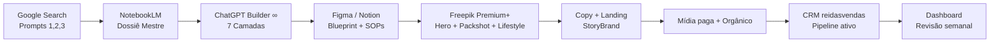

# 🧠 Builder Lab ∞ — Sistema Avançado de Criação (Físico → Digital)

Source: Notion — Builder Lab Sistema Avancado de Criacao
Page ID: e5ac677f-1a64-4a9b-a81c-bffda899dcec
URL: https://app.notion.com/p/Builder-Lab-Sistema-Avan-ado-de-Cria-o-F-sico-Digital-e5ac677f1a644a9ba81cbffda899dcec

> Builder Lab ∞ — O cérebro criativo da reidasvendas

# 🏛️ 1. Framework Builder ∞

> As 7 camadas de qualquer negócio (físico ou digital)

# 🌐 2. Referências Mundiais (Biblioteca de Padrões)

> Os melhores do mundo, organizados por disciplina. Use como repertório ao rodar os prompts — cite-os dentro do prompt (REFERENCIAS) para elevar a qualidade da resposta da IA.

# 🧩 3. Biblioteca de Variáveis (use em todos os prompts)

> Padrão VARIAVEL. Antes de disparar qualquer prompt, preencha estas variáveis. Quanto mais específica a variável, mais poderosa a resposta.

# 🔮 4. Prompts Mestres

## 🔎 4.1 Google Search — Prompts de Pesquisa Profunda

> Use estes padrões na barra do Google. Eles combinam operadores avançados (site:, intitle:, filetype:, "", OR, -) com instruções de recorte.

```plain text
# 1) Tendências mundiais do nicho
("NICHO" OR "NEGOCIO") (trends OR "state of" OR report) filetype:pdf 2024..2026

# 2) Playbooks e frameworks de referência
"NICHO" (playbook OR framework OR "case study") site:hbr.org OR site:reforge.com OR site:firstround.com OR site:a16z.com

# 3) Concorrentes e benchmarks
("NICHO" OR "NEGOCIO") ("top 10" OR "melhores" OR "best") -pinterest.com -youtube.com

# 4) Pricing e unit economics
"NICHO" (pricing OR "CAC" OR "LTV" OR "margem") filetype:pdf

# 5) Regulação / compliance (físico)
"NEGOCIO" ("vigilância sanitária" OR "ANVISA" OR "alvará" OR "CNAE") site:gov.br

# 6) Voice of Customer — reclamações reais
("NICHO" OR "PERSONA") ("odeio" OR "problema" OR "reclamação") site:reddit.com OR site:reclameaqui.com.br

# 7) Inspirações de marca / identidade
"REFERENCIAS" (branding OR identity OR "visual system") site:behance.net OR site:brandnew.underconsideration.com

# 8) Mapa de demanda (palavras-chave long tail)
"como JTBD" OR "melhor forma de JTBD" -curso -vagas
```

## 📓 4.2 Google NotebookLM — Prompts para Dossiês

> Carregue de 5 a 20 fontes (PDFs, URLs, transcrições). Depois rode os prompts abaixo dentro do NotebookLM para gerar dossiês acionáveis.

```plain text
# [DOSSIÊ MESTRE DE MERCADO]
Você é analista sênior de estratégia. Com base EXCLUSIVAMENTE nas fontes
carregadas, produza um dossiê sobre "NICHO" contendo:
1. Tese de mercado (tamanho, crescimento, ondas estruturais)
2. Cadeia de valor e players dominantes
3. Oportunidades não atendidas (white spaces)
4. 5 insights contraintuitivos citando trecho e fonte
5. Recomendação estratégica para NEGOCIO em 12 meses
Formato: markdown com tabelas e bullets. Cite a fonte em cada afirmação.

# [PERSONA VIVA + JTBD]
Extraia das fontes a persona dominante de NICHO. Entregue:
- Demografia e psicografia
- Jobs (funcional, emocional, social)
- Frases literais que ela usaria (voice of customer)
- Gatilhos de compra e objeções
- Jornada em 6 estágios (Despertar → Defesa)

# [BENCHMARK DE OFERTAS]
Compare as ofertas de CONCORRENTES nas dimensões:
promessa, público, preço, entrega, diferencial, prova, garantia.
Saída: tabela + síntese de onde NEGOCIO pode ganhar.

# [RELATÓRIO DE DOR]
Liste as 20 dores mais citadas pelo público de NICHO,
agrupadas em 4 clusters. Para cada cluster, sugira uma oferta.

# [BRIEF DE LANÇAMENTO]
Condense as fontes em um brief pronto para copywriter:
contexto, persona, dor, promessa, prova, CTA, tom, do/don't.
```

## 🎨 4.3 Freepik Premium+ (AI Image / Video / Mystic / Flux)

> Freepik Premium+ dá acesso a Mystic, Flux, Imagen, Google Veo e upscaler 10k. A anatomia abaixo garante resultados de nível editorial.

Anatomia de um prompt Freepik de alto padrão:

```plain text
[SUJEITO] + [AÇÃO/POSE] + [CENÁRIO] + [ILUMINAÇÃO] +
[LENTE/CÂMERA] + [PALETA] + [ESTILO/REFERÊNCIA] + [DETALHES TÉCNICOS] +
[NEGATIVE PROMPT]
```

Variáveis específicas de imagem:

* SUJEITO — ex: "homem 35 anos, barba bem aparada, camisa linho bege"
* CENARIO — ex: "barbearia art déco ao pôr do sol, madeira nobre"
* LUZ — ex: "luz lateral dourada, sombras longas, cinematográfica"
* LENTE — ex: "shot em Hasselblad 80mm, f/1.8, bokeh suave"
* ESTILO — ex: "editorial fashion, Annie Leibovitz meets Wes Anderson"
* PALETA — ex: "teal & amber, contraste alto, blacks ricos"
* AR — proporção (--ar 3:4, 16:9, 1:1)
* NEG — o que evitar ("low quality, extra fingers, watermark, logo")
```plain text
# PROMPT — HERO SHOT DE MARCA
Ultra-realistic editorial photograph of SUJEITO,
ACAO, set in CENARIO, LUZ,
shot on LENTE, PALETA,
in the style of ESTILO,
hyperdetailed skin texture, sharp focus, 8k, film grain,
--ar AR --stylize 750 --v mystic
Negative: NEG

# PROMPT — PRODUTO PACKSHOT
Studio packshot of PRODUTO, centered,
seamless COR_FUNDO background, soft key light + rim light,
macro lens 100mm, subtle reflection on glossy surface,
commercial catalog quality, advertising grade,
--ar 1:1 --style raw
Negative: cluttered, text, logo bleed, plastic look

# PROMPT — LIFESTYLE SOCIAL (IG)
Candid lifestyle photo of PERSONA using PRODUTO,
natural window light, morning mood, CENARIO,
documentary aesthetic, Fujifilm X-T5 color science,
authentic imperfections, 35mm film look,
--ar 4:5
Negative: staged, plastic skin, oversaturated

# PROMPT — VÍDEO (Veo / Kling)
8-second cinematic shot: camera slowly dollies in on SUJEITO
as ACAO. Golden hour, shallow depth of field, PALETA.
Ambient sound: SOM. No dialogue. Ends on a close-up of DETALHE.

# PROMPT — UPSCALE + RETOUCH
Upscale to 4K preserving skin texture, enhance micro-details on
ELEMENTO, keep original palette, denoise subtly, no face reshape.
```

## 🧠 4.4 ChatGPT/Claude — Builder Ultra (sistema completo)

```plain text
[ROLE]
Você é o "Builder ∞", arquiteto sênior de negócios.
Combine a inteligência estratégica de Porter, Christensen, Hormozi,
Cagan, Osterwalder, Godin, Dieter Rams e Jim Collins.

[OBJETIVO]
Projetar um SISTEMA completo para NEGOCIO no nicho NICHO,
transformando PERSONA em cliente recorrente, com meta de META
em PRAZO e orçamento ORCAMENTO.

[CONTEXTO]
Dor: DOR. Promessa: PROMESSA. Diferencial: DIFERENCIAL.
Concorrentes: CONCORRENTES. Restrições: RESTRICOES.
Referências: REFERENCIAS. Tom: TOM.

[ENTREGUE EM 7 CAMADAS]
1. Tese de mercado + mapa de tendências
2. Persona viva + JTBD + jornada
3. Oferta irresistível (Hormozi) + StoryBrand + Value Ladder
4. Blueprint operacional (SOPs, papéis, ferramentas)
5. Funil de aquisição (conteúdo + mídia + CRO)
6. Motor de vendas (pipeline, script, pricing, garantias)
7. Dashboard de métricas + rituais semanais/mensais

[REGRAS]
- Seja específico e acionável (nada genérico).
- Cite referências e frameworks usados em cada decisão.
- Quando houver trade-off, explicite e recomende.
- Finalize com um plano de 90 dias em tabela semanal.
```

# 🔁 5. Fluxos Ponta a Ponta

> Cada fluxo é uma sequência de prompts + ferramentas. Execute na ordem; a saída de um alimenta o próximo.

## 🚀 Fluxo A — Do Zero ao Lançamento (14 dias)



1. D1–D2 · Pesquisa Google (4.1) → colete 20 fontes.
1. D3 · NotebookLM (4.2) → dossiê + persona + benchmark.
1. D4–D5 · Builder Ultra (4.4) → sistema em 7 camadas.
1. D6–D7 · SOPs + blueprint no Notion.
1. D8–D9 · Freepik (4.3) → 20 imagens + 3 vídeos.
1. D10 · Copy + landing (StoryBrand).
1. D11–D12 · Setup de mídia (Meta/Google) + orgânico.
1. D13 · Importar pipeline para o CRM reidasvendas.
1. D14 · Lançar + dashboard ativo.
## 🏭 Fluxo B — Negócio Físico (loja/serviço local)

1. Mapa de demanda local (Google Trends + Maps).
1. Benchmark dos 5 melhores no raio de 5 km.
1. Blueprint de experiência (Disney/Starbucks).
1. SOPs operacionais (Lean/Toyota).
1. Identidade visual (Freepik + Figma).
1. Google Maps otimizado + reviews loop.
1. Programa de indicação + clube de recorrência.
## 💻 Fluxo C — Negócio Digital (infoproduto/SaaS/serviço)

1. Discovery contínuo (Teresa Torres).
1. PR-FAQ Amazon antes de construir.
1. MVP + waitlist + comunidade.
1. Oferta Hormozi + garantia forte.
1. Funil evergreen + webinar/VSL.
1. Automação (Zapier/Make/n8n).
1. Métricas North Star + Four Fits (Balfour).
## 🔄 Fluxo D — Híbrido (físico + digital)

Unifica A+B+C com camada de dados comum (CRM reidasvendas) e identidade única.

# 🧬 6. Playbooks por Nicho (seed)

> Templates iniciais. Duplique, preencha as variáveis e evolua. Use 🧩 Gerador de Sistema por Nicho — Builder OS para automatizar a geração.

# 🧱 7. Padrões de Qualidade (checklist final)

- [ ] A tese de mercado está baseada em dado, não opinião?
- [ ] A persona tem frases literais (voice of customer)?
- [ ] A oferta passa no teste dos 4 pilares de Hormozi (valor, chance, tempo, esforço)?
- [ ] O posicionamento responde "por que nós" em 1 frase?
- [ ] Existe SOP escrito para a entrega principal?
- [ ] O funil tem gatilho claro em cada etapa (TOFU/MOFU/BOFU)?
- [ ] O pricing tem ancoragem, garantia e upsell?
- [ ] Existe dashboard com no máximo 5 métricas vitais?
- [ ] Ritual semanal e mensal agendados?
- [ ] Sistema documentado no Notion e conectado ao CRM?
> Regra de ouro do Builder Lab ∞ — Se não cabe em um sistema, não cabe na reidasvendas. Construa uma vez, rode mil. Projete o sistema, não a tarefa.

> Conecte-se a reidasvendas — CRM · Builder OS — Como criar clientes no piloto automático · 🧩 Gerador de Sistema por Nicho — Builder OS · 📚 Documentação do CRM — reidasvendas
