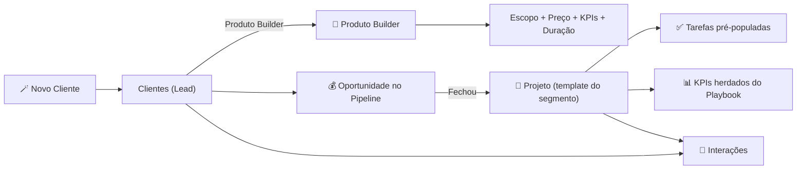

# Builder OS — Como criar clientes no piloto automático

Source: Notion — Builder OS Como criar clientes no piloto automatico
Page ID: 6cd0194d-f4c3-4217-a732-aef62d42f422
URL: https://app.notion.com/p/Builder-OS-Como-criar-clientes-no-piloto-autom-tico-6cd0194df4c34217a732aef62d42f422

> Builder OS — o sistema operacional da reidasvendas

# 🎯 O fluxo em 3 cliques

# 🧪 Por que funciona (benchmark de gigantes)

# 📘 Catálogo de Produtos Builder

> Cada linha = um kit fechado (escopo + preço + duração + entregáveis + KPIs). Abra qualquer produto para ver o blueprint completo.

* child_database: **Untitled** (a32dc371-119b-4f33-a672-69c9fea515e5)
# 🪄 Intake — faça em 2 minutos

> Passo a passo para adicionar cliente novo:

* child_database: **Untitled** (323047ba-c582-4e67-a75c-aa5bae677023)
# 🚀 Projetos — templates por segmento

> Já existem 3 templates prontos em Projetos:

* child_database: **Untitled** (f8e82e0e-964a-419a-99ae-fde0f9afad07)
# 🔘 Finalizando a automação com botões nativos (5 min)

> Importante: eu montei todo o scaffolding (playbooks + templates + relações). O passo final — criar Botões nativos do Notion — precisa ser feito por você na UI, porque botões não podem ser criados via API. São 5 minutos.

### Botão 1 — 🪄 Novo Cliente

1. Em Clientes, clique no ➕ Novo e abra a seta ao lado → Configurar templates
1. Deixe 🪄 Novo cliente (intake) como template padrão
1. Alternativa: adicione um bloco Botão nesta página com a ação "Adicionar página a Clientes" usando o template Novo cliente (intake)
### Botão 2 — 🚀 Criar projeto a partir do cliente

1. Em Projetos, configure os 3 templates (E-commerce, SaaS, Locais) como templates padrão
1. Adicione aqui um bloco Botão → ação "Adicionar página a Projetos" → escolha o template conforme o segmento
1. Configure "Editar páginas em Clientes" para que o botão marque também o cliente como Cliente Ativo e preencha Último contato = hoje
### Botão 3 (opcional) — 💬 Registrar interação

* Ação "Adicionar página a Interações", pré-preenchendo data = agora e relacionando ao cliente atual.
> Resultado final: você digita o nome do cliente, seleciona o Produto Builder, clica Novo Cliente → Criar Projeto. Em ~30 segundos tem cliente + oportunidade + projeto + checklist de tarefas + KPIs + template de interação.

# 🧠 Como o sistema pensa (mapa mental)

# 📜 Governança dos Produtos Builder

> Próximo passo sugerido: abra Clientes, clique na setinha ao lado de "Novo" e defina 🪄 Novo cliente (intake) como template padrão. Depois faça o mesmo em Projetos. Pronto, você tem o piloto automático.
