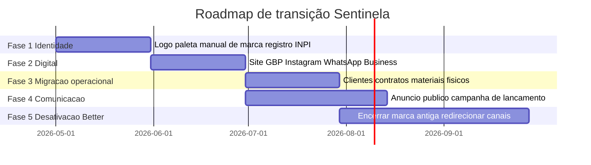

# Sentinela Saúde Ambiental

Source: Notion — Sentinela Saúde Ambiental
Page ID: 48d9df62-66b0-4d5a-bac6-0b3d919b9a49
URL: https://app.notion.com/p/Sentinela-Sa-de-Ambiental-48d9df6266b04d5abac60b3d919b9a49

> 

## 🚀 Estratégias de Crescimento

> Como usar este hub

---

# 📚 Índice rápido

---

# 📊 Dashboard Executivo

> Comando central — visão consolidada de Clientes Ativos, Pipeline Ponderado, Receita Realizada, OS Abertas, Funil de Vendas, Fluxo Mensal Receita × Despesa, Origem dos Leads, Mix da Carteira, MRR e Próximas Visitas.

---

* Database: **Dashboard Executivo — CRM Sentinela** (6a2dfea9-7086-414a-aa22-60c53a4bbf0d)
> Sentinela Saúde Ambiental — hub oficial de marca, CRM e inteligência competitiva.

---

# 💼 CRM — Operação Comercial

> Da prospecção ao pós-venda — todas as bases interconectadas por relações. Cada cliente carrega seu histórico de leads, contratos, ordens de serviço, financeiro e agenda.

## 👥 Clientes (CRM 360°)

> Base única de Pessoas Físicas e Jurídicas com status, segmento, origem, endereço georreferenciado, NPS e relacionamento. Views: Pipeline, Galeria, Mapa, Aniversários.

* Database: **Clientes (CRM)** (c19522b5-b490-4f86-b396-ea44cc1232de)
## 🎯 Leads & Pipeline

> Funil comercial com estágios, probabilidade, valor ponderado e follow-ups. Kanban visual + calendário de retorno + view de ganhos/perdidos.

* Sub-page: **🚀 Execução Agora — Sentinela: Prompt-Mestre, Auditoria Competitiva, Agenda → Gmail & Biblioteca Magnific (Imagens + Vídeos Premium+)** (dae098eb-06be-4c97-b2a1-621de2a09974)
* Database: **Leads & Pipeline de Vendas** (29243960-5df4-4e18-b783-0ba8811f69fb)
## 📋 Contratos PMOC & Recorrência

> Contratos vigentes, valores mensais, frequência de visitas e alertas de renovação. Timeline de vigência + calendário de renovações.

# 📎 Anexos

* Database: **Contratos PMOC & Recorrência** (5e8eb89f-c31a-4f0b-8801-916953de4485)
## 🛠️ Ordens de Serviço

> Cada visita = uma OS com agenda, equipe, fotos antes/depois, laudo, pragas tratadas e NPS pós-serviço. Mapa geográfico para roteirização inteligente.

* Database: **Ordens de Serviço** (1049bc23-c274-4502-9d3e-35d8638b3b64)
## 💰 Financeiro

> Fluxo de caixa completo: receitas, despesas, investimentos, impostos. Calendário de vencimentos + views específicas (A Receber, Despesas, Inadimplência).

---

* Database: **Financeiro** (97517458-429c-41ca-9041-60e039f5194e)
## 📅 Agenda CRM

> Compromissos comerciais, técnicos e internos com responsáveis, canal, local e resultado. Timeline semanal por responsável.

* Database: **Agenda CRM** (7c1d39b5-795d-490f-b10b-107b4da81f40)
---

# 👷 Equipe & Catálogo

## 👷 Equipe Técnica

> Profissionais, cargos, especialidades, registros profissionais e contatos. Quadro por cargo + galeria visual.

* Database: **Equipe Técnica** (fa9dd963-1913-4c2c-9069-3c8debb67236)
## 🧪 Catálogo de Produtos & Serviços

> Portfólio comercial completo com preço, custo, margem calculada automaticamente, duração e garantia. Galeria visual + agrupamento por categoria.

* Database: **Catálogo de Produtos & Serviços** (a68c13d8-83b4-474a-9b79-e2649a833176)
---

# 📝 Conteúdo, SEO & Crescimento

## 📝 Conteúdo & Calendário Editorial

> Funil, formato, plataforma, performance e cronograma de publicação consolidados em um único calendário editorial.

* Database: **📝 Conteúdo & Calendário Editorial** (4cb4441b-6809-4893-bd05-43ea8e9c72d7)
## 🔍 Keywords & SEO

> Intenção de busca, volume, dificuldade, oportunidades e clusters de conteúdo orgânico.

* Database: **🔍 Keywords & SEO** (801f051e-219a-46b8-9359-a7f7a1429b7e)
> Painel-mãe das estratégias: cada linha gera campanhas, conteúdos e automações vinculadas. Acompanhe CAC, LTV, ROI e ROAS.

* Database: **🚀 Estratégias de Crescimento** (77d87022-4b19-40c0-b5f1-3ed360c1c9ce)
## 🎯 Anúncios & Campanhas

> Google Ads, Meta Ads, criativos, métricas (CTR / CPA / ROAS) e timeline de veiculação.

* Database: **🎯 Anúncios & Campanhas** (898e3822-6f04-451e-a6bb-8ae79e322448)
## ⚙️ Automações & Workflows

> Integrações (Zapier, Make, n8n, APIs de IA), gatilhos, métricas de execução e ROI das automações.

* Database: **⚙️ Automações & Workflows** (54f37a82-55ac-4bac-859c-b02d8f8ea4f4)
---

# 🔍 Inteligência Competitiva

> Padrão de preenchimento (para cada concorrente)

### 📍 Franca (local)

* Database: **Untitled** (808d3de0-ae0c-453f-a1a8-3aaef8ca9f1a)
### 🗺️ Estado de São Paulo

* Database: **Untitled** (ca41b07a-dc10-4295-b313-345c1bc69402)
### 🇧🇷 Brasil (nacional)

* Database: **Untitled** (cde194fc-f1e1-4efd-89b9-6b34d20d7cb4)
### 🌎 Internacional (benchmarking)

* Database: **Untitled** (23c51e6c-77a6-457b-a05c-ec70b6dc1a00)
### 📊 Base completa de concorrentes

* Database: **🎯 Concorrentes** (142fb200-c38a-4818-8a70-94b3987569d1)
## 🪄 Biblioteca de Prompts

> Prompts validados para imagem, vídeo, copy, design e branding (Midjourney, DALL-E, ChatGPT, Claude, Stable Diffusion, etc).

* Database: **🪄 Biblioteca de Prompts** (da141f10-9080-4aee-8653-58d12d3230b5)
## 📋 Mudanças & Alertas Competitivos

> Detecção contínua de mudanças nos concorrentes: novos posts, campanhas, alterações de site, preço, branding e ações estratégicas.

* Database: **📋 Mudanças & Tracker** (2314c620-97a1-4d09-8842-9c27da7ca203)
---

# 🏢 Identificação Institucional

> Sentinela Saúde Ambiental é a marca principal e única em operação. Substitui institucionalmente a Better Controle de Pragas, preservando o legado de mais de quatro décadas de atendimento em Franca/SP.

## Dados cadastrais

## 📞 Contatos & Redes Sociais

> Pendência crítica de marca: a página Facebook ainda usa o handle /Bettercontroledepragas. Padronizar para /sentinelasaudeambiental antes de qualquer campanha paga.

---

# 🧭 Posicionamento de Marca

> Promessa central

## Os 5 eixos

## Tom de voz

---

# 🧰 Serviços

---

# 🎨 Design System

> Objetivo: padronizar visual e tom da marca em site, redes sociais, anúncios, frota, uniformes e documentos.

## Princípios

* Clareza e confiança — hierarquia tipográfica forte, layouts limpos, espaçamento generoso.
* Ambiental sem "eco genérico" — verde com profundidade + neutros quentes.
* Técnico mas humano — ícones simples, fotos reais, textos diretos.
* Acessibilidade primeiro — contraste WCAG AA e legibilidade.
* Consistência — tokens e componentes replicáveis.
## 🎨 Paleta oficial

## ✒️ Tipografia

## 🖼️ Galeria visual da marca

> Referências visuais — logo oficial, conceitos de identidade e materiais de apoio.

---

# 🚀 Plano de transição Better → Sentinela

## Roadmap (5 fases)

## Checklist operacional

- [ ] Definir CNPJ / razão social oficial da Sentinela
- [ ] Registrar marca no INPI
- [ ] Aprovar logo + paleta + tipografia definitivos
- [ ] Publicar site oficial
- [ ] Criar / migrar Google Business Profile
- [ ] Migrar e renomear página de Facebook (/Bettercontroledepragas → /sentinelasaudeambiental)
- [ ] Criar Instagram oficial
- [ ] Migrar carteira de clientes da Better
- [ ] Migrar contratos PMOC vigentes
- [ ] Atualizar materiais físicos (frota, uniformes, cartões)
- [ ] Comunicar mudança aos clientes ativos
---

# 📚 Documentação Regulatória

> Conformidade ANVISA, POPs, FISPQ, licenças, laudos e modelos. Acesse a pasta dedicada abaixo.

* Sub-page: **📚 Regras Sanitárias, ANVISA & Documentos** (279853c4-9850-499b-9ba5-c9bb907e354c)
---

# 📁 Sub-páginas & arquivos

* Sub-page: **Better** (71e6a0ec-33b1-483c-b424-032caf78d60f)
* Sub-page: **Site Rogério (Sentinela)** (a76731fc-18d5-4f71-9ed8-68228a0d4ab4)