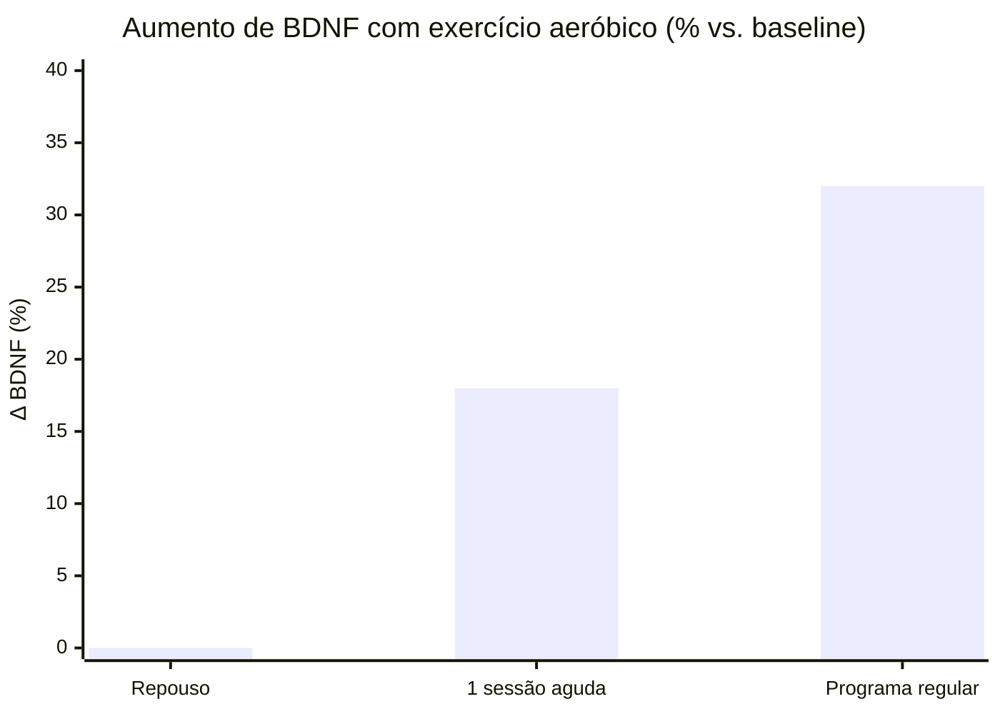
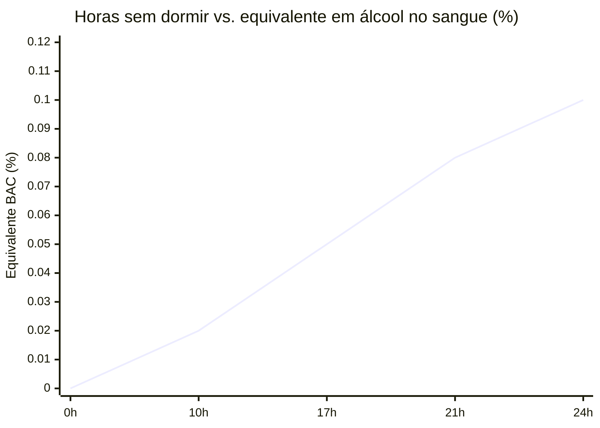
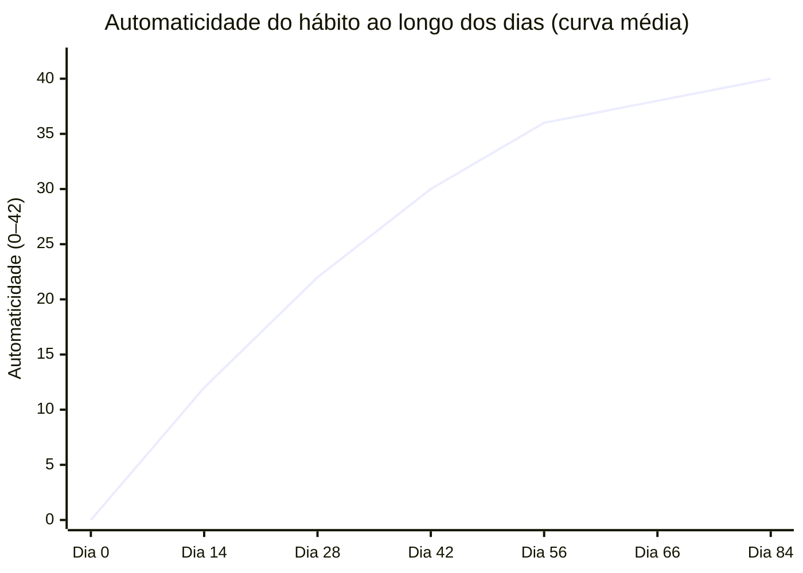
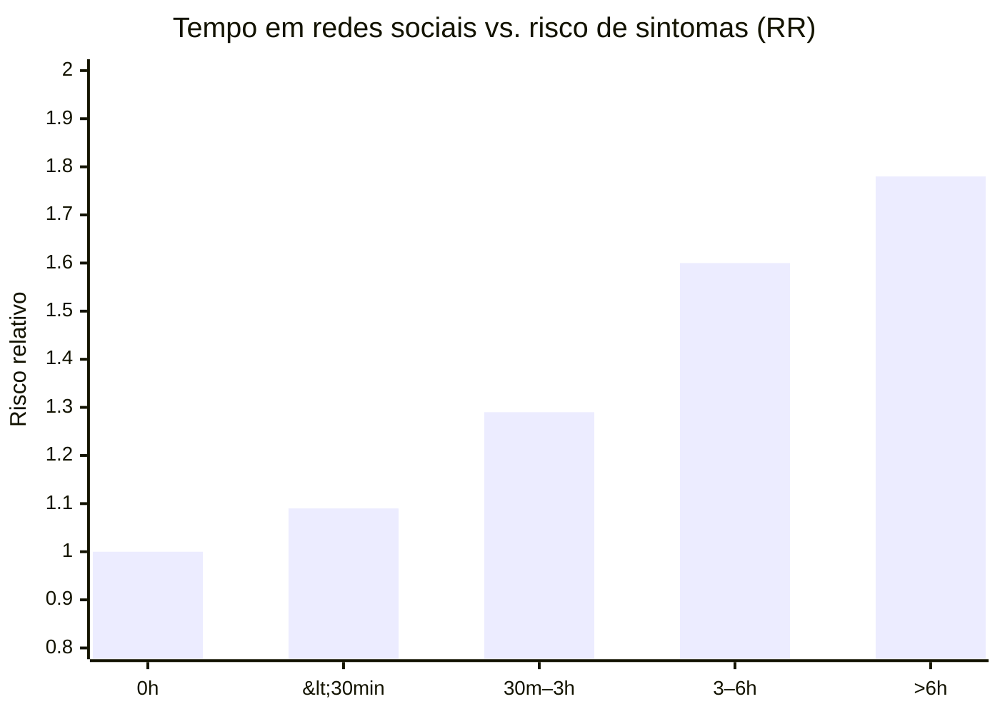

# Site Farma Thiago — Neuroperformance Integral

Source: Notion — Site Farma Thiago
Page ID: 3538a253-0044-8090-bec5-da6fe689d9a5
URL: https://app.notion.com/p/Site-Farma-Thiago-Neuroperformance-Integral-3538a25300448090bec5da6fe689d9a5

> Neuroperformance Integral (na prática)

### Para quem é este conteúdo

* Para pessoas que querem entender o próprio cérebro e criar hábitos melhores.
* Para profissionais de farmácia e saúde que querem orientar com ética e base científica.
> Aviso importante (ética e segurança)

---

## A ideia central em linguagem simples

Pense assim:

* Cérebro é um órgão que aprende. Ele muda com repetição.
* Medicamento, quando necessário, ajuda a estabilizar. Mas ele raramente “constrói” sozinho a vida que você quer.
* O que muda o jogo é um sistema de hábitos. Pequenas ações repetidas que viram um novo padrão.
O que esta abordagem defende:

* Ciência aplicada, explicada de um jeito que dá para usar amanhã.
* Autonomia com responsabilidade.
* Comunicação direta e acolhedora, sem infantilizar ninguém.
---

## O que realmente melhora a vida (os 4 pilares)

### 1) Movimento e condicionamento (VO2) — o “remédio” que não vem em cápsula

O que é: capacidade do corpo de usar oxigênio. Quanto melhor isso, melhor costuma ser a saúde do coração, do metabolismo e do cérebro.

Por que ajuda o cérebro: exercícios regulares aumentam fatores ligados à plasticidade (como BDNF), que favorecem aprendizado e humor.

Como fazer virar hábito (sem drama):

* Comece pequeno: 15 minutos. O objetivo é aparecer, não “virar atleta”.
* Deixe fácil: roupa já separada. horário combinado. rota pronta.
* Recompensa rápida: registrar no app, marcar no calendário, ou um ritual pós-treino (banho, música, relaxar).
Frase-guia: “Consistência vence intensidade.”

---

### 2) Prazer rápido x prazer de verdade (Hedonia x Eudaimonia)

O problema comum: quando a rotina fica só em prazer rápido (tela, comida ultraprocessada, dopamina fácil), o cérebro pode “perder a graça” do básico.

A virada: trocar uma parte do prazer vazio por realização.

Exemplo simples:

* Antes de abrir redes sociais à noite, ler 10 páginas de um livro.
* Ou caminhar 10 minutos e voltar.
Regra de ouro: não é sobre cortar tudo. É sobre trocar 1 coisa por vez.

---

### 3) Hábitos são circuitos (Lei de Hebb) — e circuitos mudam

“Neurônios que disparam juntos, se ligam juntos.”

O loop do hábito (bem direto):

1. Gatilho: o que dispara (tédio, ansiedade, horário, lugar).
1. Rotina: o que você faz no automático.
1. Recompensa: o que o cérebro ganha (alívio, prazer, fuga, controle).
Como trocar sem sofrer:

* Não tente mudar a vida inteira.
* Troque só a rotina, mantendo gatilho e recompensa parecidos.
Exemplos práticos:

* Gatilho: tédio no trabalho → Rotina antiga: redes sociais → Nova rotina: levantar, água, 10 agachamentos → Recompensa: energia e sensação de “voltei”.
* Gatilho: ansiedade à noite → Rotina antiga: scroll infinito → Nova rotina: banho quente + livro físico → Recompensa: relaxamento real.
---

### 4) Sono — o pilar que faz todo o resto funcionar

Sem sono, o cérebro perde freio. A atenção, o humor e o autocontrole pioram.

Higiene do sono (o que mais funciona na vida real):

* Luz: pegar sol de manhã. diminuir luz forte à noite.
* Temperatura: quarto mais fresco.
* Ritual: 30 minutos sem tela, com leitura física, respiração e alongamento leve.
Meta honesta: não é “perfeição”. é “melhorar 10% por semana”.

---

## Tecnologia: usar a favor, não contra

### Redes sociais (sem moralismo)

Como o algoritmo prende: recompensa imprevisível (tipo cassino).

Plano de higiene digital:

1. Limpar: deixar de seguir o que piora humor e foco.
1. Curar: seguir pessoas e páginas que constroem (ciência, saúde, filosofia prática, treino sério).
1. Delimitar: 2 janelas por dia, com tempo definido.
### IA como “cérebro executivo” (uso saudável)

A IA pode ajudar a organizar e lembrar, sem substituir o pensamento.

Usos bons (e éticos):

* Planejar semana equilibrada (trabalho, treino, estudo, sono, lazer).
* Criar checklists de adesão (medicação, sono, treino, alimentação).
* Fazer revisão espaçada (ex.: Anki) para estudar melhor.
Cuidado: usar IA o tempo todo pode virar sedentarismo mental. Use para apoiar, não para viver no piloto automático.

---

## Como conversar com gente de verdade (sem “robô”)

Este site segue três regras:

* Clareza acima de tudo: sem jargão quando não precisa.
* Humildade clínica: quando não dá para afirmar, a gente diz “não sei” e mostra o que a ciência sugere.
* Responsabilidade: sempre indicar quando procurar avaliação profissional.
Frases que ajudam (e respeitam o adulto):

* “Vamos por partes, do jeito mais simples possível.”
* “Me conta como isso aparece no seu dia a dia.”
* “Para eu garantir que ficou claro, você pode repetir com suas palavras o plano?”
---

## Para farmácias: como transformar isso em serviço (com ética)

Aqui vai um modelo simples de como aplicar sem prometer milagre.

### 1) Triagem curta (2–3 minutos)

* O que está pegando hoje: sono, ansiedade, energia, foco, adesão ao tratamento.
* Quais medicamentos usa e quais horários.
* Red flags (urgência): sinais graves, risco de autoagressão, reações alérgicas, confusão mental, etc.
### 2) Plano de 1 hábito por vez (4 semanas)

* Um objetivo pequeno.
* Um gatilho definido.
* Uma rotina simples.
* Uma recompensa clara.
### 3) Acompanhamento (check-in rápido)

* 1 a 2 perguntas por dia ou por semana.
* Sem julgamento.
* Ajuste do plano conforme barreiras reais.
> Ética e conformidade (resumo prático)

---

## Os números que comprovam (evidência em uma olhada)

> Como ler esta seção

### 1) Movimento e VO2 — quanto mais condicionamento, menos mortalidade

Número-chave: cada aumento de 1 MET no VO2máx está associado a −13% de mortalidade por todas as causas.

Fonte: Kodama et al., 2009, JAMA, meta-análise com 102.980 participantes.

Cérebro também ganha: meta-análise de 29 estudos mostra que o exercício aeróbico aumenta o BDNF circulante em média ~30% após programas regulares (Szuhany, Bugatti & Otto, 2015, J Psychiatr Res).

---

### 2) Sono — o pilar com a curva mais clara

Número-chave: dormir menos de 6h/noite aumenta o risco de mortalidade em +12%; mais de 9h, em +30% (Cappuccio et al., 2010, Sleep, meta-análise com 1,38 milhão de pessoas).

Privação de sono = álcool ao volante: 17h acordado equivale a 0,05% de álcool no sangue; 24h equivale a 0,10% (Williamson & Feyer, 2000, Occup Environ Med).

Limpeza do cérebro durante o sono: o sistema glinfático aumenta a remoção de metabólitos (incluindo β-amiloide) em ~60% durante o sono em comparação à vigília (Xie et al., 2013, Science).

---

### 3) Hábitos — quanto tempo até virar automático?

Número-chave: em média 66 dias para um hábito atingir o platô de automaticidade, com variação de 18 a 254 dias conforme a complexidade do comportamento (Lally, van Jaarsveld, Potts & Wardle, 2010, Eur J Soc Psychol).

Quanto da sua vida já é piloto automático?

Leitura prática: quase metade do seu dia já é hábito. A pergunta não é “devo ter hábitos?”, é “quais hábitos eu deixo no automático?”.

---

### 4) Tecnologia e saúde mental — a curva de exposição

Número-chave: adolescentes que passam mais de 3h/dia em redes sociais têm risco ~60% maior de sintomas depressivos e de ansiedade em comparação a quem não usa (Riehm et al., 2019, JAMA Psychiatry, n=6.595).

Celular no quarto: meta-análise mostrou que ter o celular ao lado da cama está associado a −21 minutos de tempo total de sono e +16 minutos para iniciar o sono (Carter et al., 2016, JAMA Pediatr).

---

### Resumo executivo (números para guardar)

> Como interpretar os números

---

## Referências (para aprofundar)

* Skinner, B.F. Science and Human Behavior (1953).
* Duhigg, C. The Power of Habit (2012).
* Clear, J. Atomic Habits (2018).
* Xie et al. (2013). Sleep Drives Metabolite Clearance from the Adult Brain. Science.
* Raichle, M.E. (2015). The Brain's Default Mode Network. Annual Review of Neuroscience.
* Cotman, C.W., & Berchtold, N.C. (2002). Exercise: a behavioral intervention to enhance brain health and plasticity. Trends in Neurosciences.
* Ryff, C.D., & Singer, B.H. (2008). A eudaimonic approach to psychological well-being. Journal of Happiness Studies.
---

## Prompts para imagens realistas (Magnific)

> Como usar: copie e cole um prompt por vez no Magnific. Para consistência visual, mantenha o mesmo estilo (lente, luz, paleta) e só troque o assunto.

### Diretrizes rápidas (para ficar consistente)

* Estilo base: fotografia realista, 35mm ou 50mm, profundidade de campo suave, luz natural.
* Paleta: azul, branco e tons neutros, sensação clínica e acolhedora.
* Qualidade: ultra-detalhado, pele natural, sem “cara de IA”.
* Evitar: textos legíveis na imagem, logos, marcas, distorções anatômicas.
### 1) Hero / capa do site

* Prompt 01 (neuroperformance, humano e calmo):
* Prompt 02 (farmacêutico com ética, sem jaleco caricatural):
### 2) Pilares (4 imagens)

* Movimento e condicionamento (VO2):
* Hedonia x eudaimonia (equilíbrio):
* Hábitos e rotina (consistência):
* Sono (higiene do sono):
### 3) Tecnologia (sem moralismo)

* Redes sociais (limites saudáveis):
* IA como apoio (organização):
### 4) Comunicação humana (acolhedora)

* Conversa real (sem robô):
### 5) Farmácia como serviço (triagem e acompanhamento)

* Triagem curta:
* Acompanhamento (check-in):
### 6) Imagens de apoio (detalhes e texturas)

* Rotina matinal (sol de manhã):
* Alimentação simples:
### 7) Prompts-modulares (para gerar infinitas variações)

Copie e troque o que está entre colchetes.

* Modelo A (pessoa + contexto):
* Modelo B (close-up de hábito):
* Modelo C (consulta):
### 8) Bloco de negativos (cole junto, se o Magnific aceitar)

* "no text, no readable words, no logos, no brand names, no watermark, no extra fingers, no deformed hands, no plastic skin, no exaggerated bokeh, no uncanny face, no oversharpening"