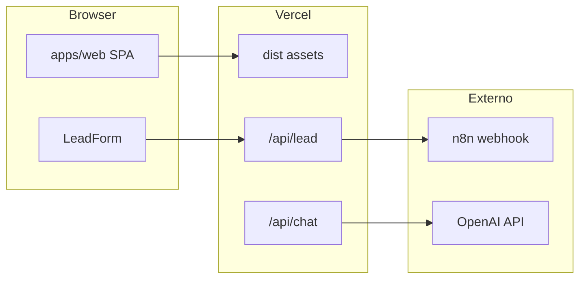

# Deploy Vercel — Rei das Vendas

Guia operacional do monorepo `tpiola/reidasvendas` (site em `apps/web`).

## Arquitetura



## Configuração recomendada (dashboard Vercel)

| Campo | Valor |
|-------|--------|
| **Root Directory** | `apps/web` |
| **Framework Preset** | Vite |
| **Install Command** | `cd ../.. && pnpm install --frozen-lockfile` |
| **Build Command** | `cd ../.. && pnpm turbo run build --filter=web` |
| **Output Directory** | `dist` |
| **Production Branch** | `main` |

Alternativa (import pela raiz do repo): usar [`vercel.json`](../vercel.json) na raiz com `outputDirectory: apps/web/dist` e `buildCommand: pnpm turbo run build --filter=web`.

Headers CSP, cache de `/assets` e rewrites SPA estão em [`apps/web/vercel.json`](../apps/web/vercel.json).

## Variáveis de ambiente

Copiar de [`apps/web/.env.example`](../apps/web/.env.example). Configurar em **Production** e **Preview** no painel Vercel.

| Variável | Obrigatória | Efeito se ausente |
|----------|-------------|-------------------|
| `LEAD_WEBHOOK_URL` | Sim (formulários) | `POST /api/lead` → 500 `missing_webhook` |
| `LEAD_WEBHOOK_SECRET` | Não | Header opcional para n8n |
| `OPENAI_API_KEY` | Só com chat | Chat desabilitado ou erro |
| `VITE_GA4_ID` / `VITE_GTM_ID` | Não | Site funciona; analytics off |
| `VITE_CHAT_ENABLED` | Não | Widget oculto por padrão |

Workflow n8n: importar [`n8n/workflows/ALTHIQ-Leads-Intake-v1.json`](../n8n/workflows/ALTHIQ-Leads-Intake-v1.json) e apontar a URL em `LEAD_WEBHOOK_URL`.

Detalhes: [`docs/INTEGRATIONS.md`](INTEGRATIONS.md).

## Domínios

- Produção: https://reidasvendas.com.br/ (e aliases `*.vercel.app`)
- SEO/canonical no código: `reidasvendas.com` — alinhar DNS e redirects no painel se necessário

## Validação local (antes do push)

```bash
pnpm install --frozen-lockfile
pnpm run ci
# ou: pnpm check && pnpm lint && pnpm test && pnpm build:web && pnpm -C apps/web e2e
```

Confirmar `apps/web/dist/index.html` após `pnpm build:web`.

Preview com funções serverless: deploy Preview na Vercel (`vite preview` local **não** expõe `/api/lead`).

## Checklist pós-deploy

- [ ] Build Vercel **Ready** (branch `main`)
- [ ] Home e `/contato` retornam 200; refresh em rota interna não dá 404
- [ ] `POST /api/lead` com payload válido → 200 (requer `LEAD_WEBHOOK_URL`)
- [ ] `LEAD_WEBHOOK_URL` configurado no projeto `v0-rei-das-vendas`
- [ ] Domínio custom resolvendo (se aplicável)
- [ ] Lighthouse mobile > 80 (meta orientativa)

## Smoke test (produção)

```bash
curl -sS -o /dev/null -w "%{http_code}\n" https://reidasvendas.com.br/
curl -sS -o /dev/null -w "%{http_code}\n" https://reidasvendas.com.br/contato
curl -sS -X POST https://reidasvendas.com.br/api/lead \
  -H "Content-Type: application/json" \
  -d '{"email":"test@example.com","source":"hero","variant":"A","consent":true}'
```

## Riscos e mitigação

| Risco | Mitigação |
|-------|-----------|
| Deploy servindo build velho de `public/` na raiz | Pasta `/public/` no `.gitignore`; output `apps/web/dist` |
| APIs não deployam | Root Directory = `apps/web` |
| Formulário quebra em prod | `LEAD_WEBHOOK_URL` no painel |
| CSP bloqueia GTM/GA4 | Ajustar `script-src` em `apps/web/vercel.json` quando IDs forem ativados |

## Projeto Vercel

- **Nome:** `v0-rei-das-vendas`
- **Repositório:** `tpiola/reidasvendas`
- Deploy automático via integração GitHub em push/merge em `main`
